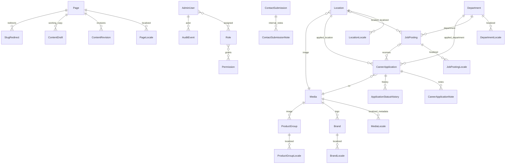

# Data Model v0.3

Logical model. The exact implemented Drizzle schema is `src/db/schema.ts`; the
initial PostgreSQL migration is committed under `drizzle/`.

## Authentication / Authorization

### AdminUser

```text
id
auth0_subject
email
display_name
status
mfa_enrolled_at
created_at
updated_at
last_login_at
```

### Role

```text
id
key
name
```

### Permission

```text
id
key
resource
action
```

### UserRole / RolePermission

Join mappings. `RolePermission` also stores a permission scope:

```text
all | content | public_locale | recruitment | retention
```

---

## Public Content

### Page

```text
id
route_key
template_key
created_at
updated_at
```

### PageLocale

```text
id
page_id
locale
slug
title
body/content_json
seo_title
seo_description
og_title
og_description
og_media_id nullable
allow_indexing
publish_status
published_at
scheduled_publish_at
scheduled_archive_at nullable
```

### ContentRevision

```text
id
entity_type
entity_id
locale
revision_no
snapshot
created_by
created_at
```

### ContentDraft

```text
entity_type
entity_id
locale
snapshot
updated_by
updated_at
```

`ContentDraft` is the mutable working copy. It does not replace or hide the
currently published locale row. Publish applies it atomically; rollback writes a
new working copy and revision.

### SlugRedirect

```text
id
locale
entity_type
entity_id
old_path
new_path
http_status        # 301
created_at
disabled_at nullable
```

---

## Brands

### Brand

```text
id
name
logo_media_id
featured
sort_order
status
```

### BrandLocale

```text
brand_id
locale
short_description
publish_status
published_at
scheduled_publish_at
scheduled_archive_at nullable
```

---

## Product Groups

### ProductGroup

```text
id
key
image_media_id
sort_order
status
```

### ProductGroupLocale

```text
product_group_id
locale
name
slug
short_description
publish_status
published_at
scheduled_publish_at
scheduled_archive_at nullable
```

---

## Locations

### Location

```text
id
key
address fields TBD
phone/email TBD
latitude/longitude TBD
media_id
sort_order
status
```

### LocationLocale

```text
location_id
locale
name
description
working_hours_text
publish_status
published_at
scheduled_publish_at
scheduled_archive_at nullable
```

---

## Departments

### Department

```text
id
key
sort_order
status
```

### DepartmentLocale

```text
department_id
locale
name
description nullable
publish_status
published_at
scheduled_publish_at
scheduled_archive_at nullable
```

Initial department records:

```text
sales
finance
accounting
it
import-export
warehouse-shipping
```

---

## Careers

### JobPosting

```text
id
department_id
location_id nullable
status
published_at nullable
closing_at nullable
```

### JobPostingLocale

```text
job_posting_id
locale
title
slug
summary
description
publish_status
published_at
scheduled_publish_at
scheduled_archive_at nullable
```

### CareerApplication

```text
id
job_posting_id nullable
idempotency_key_hash unique nullable after anonymization

first_name
last_name
phone_normalized
email_normalized

gender nullable/approval-gated
birth_date nullable/approval-gated
marital_status nullable/approval-gated
military_status nullable/approval-gated
deferment_date nullable/approval-gated

department_id
location_id
knows_company
knows_company_source nullable
expected_salary_try
available_from
about_text
cv_file_id

locale
privacy_notice_version
privacy_notice_shown_at
privacy_acknowledged_at nullable

status
created_at
updated_at
retention_due_at
retention_hold_until nullable
anonymized_at nullable
```

### CareerApplicationNote

```text
id
application_id
body
created_by
created_at
```

### ApplicationStatusHistory

```text
id
application_id
from_status
to_status
changed_by
changed_at
```

---

## Contact

### ContactSubmission

```text
id
idempotency_key_hash unique nullable after anonymization
name
company nullable
email_normalized
phone_normalized nullable
subject
message

locale
privacy_notice_version
privacy_notice_shown_at
privacy_acknowledged_at nullable

status
created_at
retention_due_at
retention_hold_until nullable
anonymized_at nullable
```

### ContactSubmissionNote

```text
id
contact_submission_id
body
created_by
created_at
```

Internal notes inherit the Contact permission boundary, are removed by contact
retention anonymization and are never copied into audit metadata.

### SubmissionNotification

Durable notification outbox. PostgreSQL submission records remain authoritative;
email is a retryable notification channel and never contains form PII.

```text
id
purpose                 # career | contact
career_application_id nullable
contact_submission_id nullable
locale
status                  # pending | sent | failed | cancelled
attempt_count
next_attempt_at
last_error_code nullable
sent_at nullable
created_at
updated_at
```

Exactly one resource relation matches `purpose`. One notification row exists per
accepted submission. Career delivery remains pending until its CV is both
`scan_status = clean` and `storage_class = protected`; infected/missing files
cancel delivery without exposing scanner output.

---

## Media

### Media

```text
id
storage_class       # public | protected | quarantine
storage_key
original_filename
mime_type
size_bytes
width nullable
height nullable
focal_x nullable
focal_y nullable
scan_status nullable     # pending | clean | infected | error
scan_attempt_count
scan_requested_at nullable
scan_completed_at nullable
scan_last_result nullable
scan_last_error_code nullable
scan_next_retry_at nullable
created_by nullable
created_at
```

### MediaLocale

```text
media_id
locale
alt_text nullable
caption nullable
publish_status nullable
published_at nullable
scheduled_publish_at nullable
```

Notes:

- public meaningful imagery should have localized alt text,
- decorative media may use empty alt semantics,
- placement-specific alt override may be supported when context changes meaning.

---

## Settings / Audit

### SiteSetting

```text
key
typed_value
updated_by
updated_at
```

Secrets do not belong here.

### AuditEvent

```text
id
actor_user_id nullable
event_type
resource_type
resource_id nullable
metadata_redacted
created_at
```

Audit records are append-oriented.

### MalwareScanEvent

```text
provider_event_id unique
media_id
result
processed_at
```

Provides at-least-once GuardDuty event idempotency.

### RateLimitBucket

```text
route
identifier_hash       # HMAC; never raw IP/form identity
window_started_at
request_count
expires_at
```

---

## ER Overview



## Rules

- stable IDs are language-neutral,
- localized entities have locale publication state,
- form provenance is stored,
- CV uses protected/quarantine media storage,
- departments are managed entities,
- audit metadata avoids raw sensitive content.

## Milestone 1 Implementation Notes

- PostgreSQL enums share the application `tr/en`, route-key, publication,
  storage and scan-state contracts.
- Every localized table has locale-owned publication fields.
- `job_posting_id` remains nullable for general applications.
- Form retention deadlines and privacy provenance are required by schema;
  acknowledgement timestamps remain nullable pending approved legal wording.
- Location address/contact structure remains JSON `TBD` until approved exact
  business data/field requirements exist.
- `SiteSetting` uses a non-secret key allowlist. Credentials and tokens are not
  valid CMS setting keys.
- A protected `Media` row requires `scan_status = clean`; moving/copying the
  object and updating the row is implemented in the security milestone.

## Milestone 2 Implementation Notes

- `AdminUser.auth0_subject` is unique and is the sole Auth0-to-local identity
  binding; authorization still requires active local status.
- Permission grants are atomic and scoped; roles are grouping records only.
- Candidate/contact PII columns can become null only after anonymization. The
  database retains required-at-submission checks while supporting retention.
- A CV media row is unique to one application. GuardDuty provider event IDs are
  unique, and non-clean files cannot satisfy the protected-storage constraint.
- Audit rows are protected by a PostgreSQL trigger that rejects update/delete.

## Milestone 6 Implementation Notes

- Public localized rows and mutable working copies are separate, so editing and
  scheduling do not remove the current publication.
- `PageLocale` now stores Open Graph fields and an explicit indexing flag; OG
  media remains constrained to the public media model.
- `ContactSubmissionNote` provides permission-scoped internal notes and cascades
  with the parent record; due-retention anonymization deletes notes first.
- `ContentDraft` is generic across page, collection and public-media locale
  working copies. It contains public/editorial data only, never contact/candidate
  PII or secrets.
