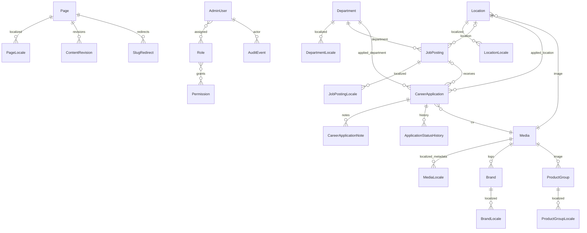

# Data Model v0.3

Logical model; exact ORM schema follows during implementation.

## Authentication / Authorization

### AdminUser

```text
id
email
display_name
status
mfa_enrolled_at
created_at
updated_at
last_login_at
```

### Role

```text
id
key
name
```

### Permission

```text
id
key
resource
action
```

### UserRole / RolePermission

Join mappings.

---

## Public Content

### Page

```text
id
route_key
template_key
created_at
updated_at
```

### PageLocale

```text
id
page_id
locale
slug
title
body/content_json
seo_title
seo_description
publish_status
published_at
scheduled_publish_at
scheduled_archive_at nullable
```

### ContentRevision

```text
id
entity_type
entity_id
locale
revision_no
snapshot
created_by
created_at
```

### SlugRedirect

```text
id
locale
entity_type
entity_id
old_path
new_path
http_status        # 301
created_at
disabled_at nullable
```

---

## Brands

### Brand

```text
id
name
logo_media_id
featured
sort_order
status
```

### BrandLocale

```text
brand_id
locale
short_description
publish_status
published_at
scheduled_publish_at
scheduled_archive_at nullable
```

---

## Product Groups

### ProductGroup

```text
id
key
image_media_id
sort_order
status
```

### ProductGroupLocale

```text
product_group_id
locale
name
slug
short_description
publish_status
published_at
scheduled_publish_at
scheduled_archive_at nullable
```

---

## Locations

### Location

```text
id
key
address fields TBD
phone/email TBD
latitude/longitude TBD
media_id
sort_order
status
```

### LocationLocale

```text
location_id
locale
name
description
working_hours_text
publish_status
published_at
scheduled_publish_at
scheduled_archive_at nullable
```

---

## Departments

### Department

```text
id
key
sort_order
status
```

### DepartmentLocale

```text
department_id
locale
name
description nullable
publish_status
published_at
scheduled_publish_at
scheduled_archive_at nullable
```

Initial department records:

```text
sales
finance
accounting
it
import-export
warehouse-shipping
```

---

## Careers

### JobPosting

```text
id
department_id
location_id nullable
status
published_at nullable
closing_at nullable
```

### JobPostingLocale

```text
job_posting_id
locale
title
slug
summary
description
publish_status
published_at
scheduled_publish_at
scheduled_archive_at nullable
```

### CareerApplication

```text
id
job_posting_id nullable

first_name
last_name
phone_normalized
email_normalized

gender nullable/approval-gated
birth_date nullable/approval-gated
marital_status nullable/approval-gated
military_status nullable/approval-gated
deferment_date nullable/approval-gated

department_id
location_id
knows_company
knows_company_source nullable
expected_salary_try
available_from
about_text
cv_file_id

locale
privacy_notice_version
privacy_notice_shown_at
privacy_acknowledged_at nullable

status
created_at
updated_at
retention_due_at
```

### CareerApplicationNote

```text
id
application_id
body
created_by
created_at
```

### ApplicationStatusHistory

```text
id
application_id
from_status
to_status
changed_by
changed_at
```

---

## Contact

### ContactSubmission

```text
id
name
company nullable
email_normalized
phone_normalized nullable
subject
message

locale
privacy_notice_version
privacy_notice_shown_at
privacy_acknowledged_at nullable

status
created_at
retention_due_at
```

---

## Media

### Media

```text
id
storage_class       # public | protected | quarantine
storage_key
original_filename
mime_type
size_bytes
width nullable
height nullable
focal_x nullable
focal_y nullable
scan_status nullable     # pending | clean | infected | error
scan_completed_at nullable
created_by nullable
created_at
```

### MediaLocale

```text
media_id
locale
alt_text nullable
caption nullable
publish_status nullable
published_at nullable
scheduled_publish_at nullable
```

Notes:

- public meaningful imagery should have localized alt text,
- decorative media may use empty alt semantics,
- placement-specific alt override may be supported when context changes meaning.

---

## Settings / Audit

### SiteSetting

```text
key
typed_value
updated_by
updated_at
```

Secrets do not belong here.

### AuditEvent

```text
id
actor_user_id nullable
event_type
resource_type
resource_id nullable
metadata_redacted
created_at
```

Audit records are append-oriented.

---

## ER Overview



## Rules

- stable IDs are language-neutral,
- localized entities have locale publication state,
- form provenance is stored,
- CV uses protected/quarantine media storage,
- departments are managed entities,
- audit metadata avoids raw sensitive content.
